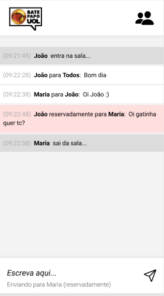

<h1 align="center">Bate Papo UOL </h1>

<p align="justify">Esse desafio, foi desenvolver a aplicação do Bate Papo UOL a partir de um layout, colocando em prática tudo o que aprendi.</p>
<hr/>
## ✅ Requisitos

- Geral
    - [x]  Não utilize nenhuma biblioteca para implementar este projeto (jquery, lodash, react, etc), nem outras linguagens que compilem para JavaScript (TypeScript, Clojure, ELM, etc), somente JavaScript puro.
    - [x]  Seu projeto deverá ser desenvolvido utilizando Git e GitHub, em um repositório público.
    - [x]  A cada requisito implementado faça um *commit* com uma mensagem descritiva do que você evoluiu.
- *Layout*
    - [x]  Aplicar *layout* para mobile, seguindo o Figma. Não é necessário implementar uma versão para *desktop*.
- *Chat*
    - [x]  Ao entrar na sala, este deve carregar as mensagens do servidor quando o usuário estiver logado e exibi-las conforme *layout* fornecido.
    - [x]  Existem três tipos de mensagem:
        - Mensagens de status (**Entrou** ou **Saiu** da sala): deve ter o fundo cinza;
        - Mensagens reservadas (**Reservadamente**): deve ter o fundo rosa;
        - Mensagens normais: devem ter o fundo branco.
    - [x]  A cada três segundos o site deve recarregar as mensagens do servidor para manter sempre atualizado.
    - [x]  O *chat* deverá ter rolagem automática por padrão, ou seja, sempre que novas mensagens forem adicionadas ao final do *chat* ele deve *scrollar* para o final.
        - 🔥 **Dica**: Você pode fazer com que um elemento apareça na tela utilizando a função `scrollIntoView`:
            
            ```jsx
            const elementoQueQueroQueApareca = document.querySelector('.mensagem');
            elementoQueQueroQueApareca.scrollIntoView();
            ```
            
        - Se `elementoQueQueroQueApareca` estiver dentro de um elemento “scrollável”, o elemento será “scrollado” para que o `elementoQueQueroQueApareca` fique visível.
    - [x]  As mensagens com **Reservadamente** só devem ser exibidas se o nome do destinatário ou remetente for igual ao nome do usuário que está usando o chat (ou senão ele poderia ver as mensagens reservadas para outras pessoas)
        - **⚠️ Atenção:** Fazer essa filtragem no *front-end* não é uma boa prática, o ideal seria o servidor não fornecer essas mensagens para outras pessoas. Entretanto, manteremos dessa forma por fins didáticos. Combinado? 😁
- Entrada na sala
    - [x]  Ao entrar no site, o usuário deverá ser perguntado com um `prompt` ****seu lindo nome.
    - [x]  Após inserção do nome, este deve ser enviado para o servidor pra cadastrar o usuário:
        - Caso o servidor responda com sucesso, o usuário poderá entrar na sala;
        - Caso o servidor responda com erro, deve-se pedir para o usuário digitar outro nome, pois este já está em uso;
    - [x]  Enquanto o usuário estiver na sala, a cada 5 segundos o site deve avisar ao servidor que o usuário ainda está presente, ou senão será considerado que "Saiu da sala".
- Envio de mensagem
    - [x]  Ao enviar uma mensagem, esta deve ser enviada para o servidor:
        - Caso o servidor responda com sucesso, você deve obter novamente as mensagens do servidor e atualizar o *chat;*
        - Caso o servidor responda com erro, significa que esse usuário não está mais na sala e a página deve ser atualizada (e com isso voltando pra etapa de pedir o nome).
            - 🔥 **Dica**: experimente usar `window.location.reload()`
    - [x]  Nesse envio, deve ser informado o remetente, o destinatário e se a mensagem é reservada ou não.
        - Escolher um destinatário e se a mensagem é reservada ou pública é um requisito bônus (ver abaixo). Logo, se você não implementar o bônus, sempre envie destinatário como Todos e a mensagem como pública.
<hr/>

## 🛠 &nbsp;Skills
<div align="center">
  
  
  
          
  
                                     
</div>
<hr/>

## 🚀 &nbsp;Links

- [Figma](https://www.figma.com/file/eviXSw3MnQVphvpalRT78c/Chat-UOL?node-id=0%3A1&t=Tl8FTcamuHGut3G8-0).<br/>
- [Deploy](https://projeto5-batepapouol-mocha.vercel.app/).<br/>
___

## 💬 &nbsp;Contact


Feito por [Raissa Curty](https://github.com/curtyraissa)!

<a href="https://www.linkedin.com/in/raissa-curty/" target="_blank">
    
  </a>&nbsp;
